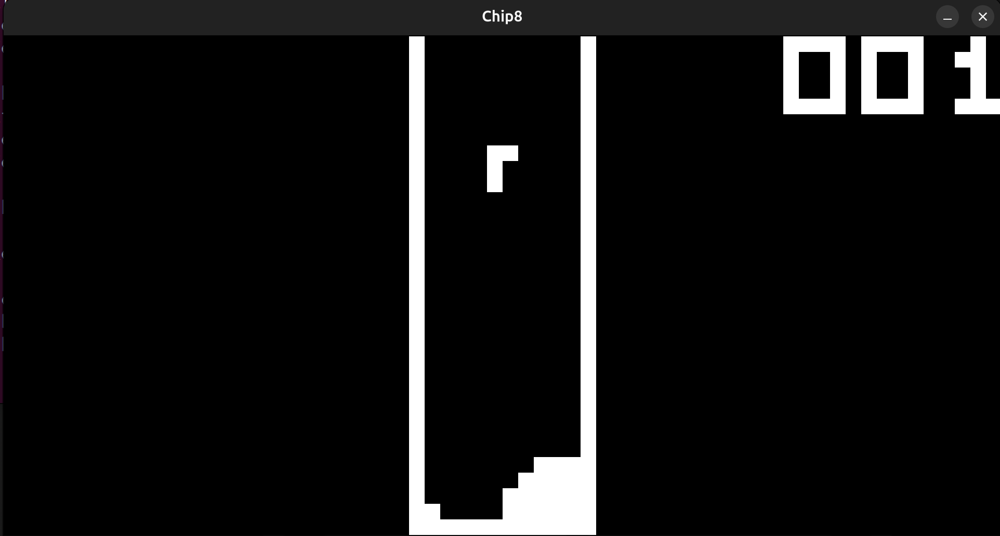
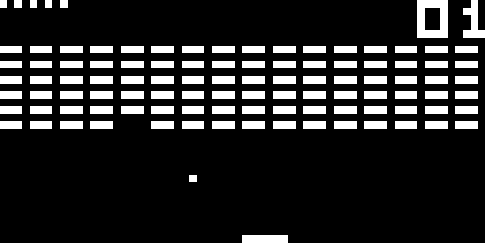
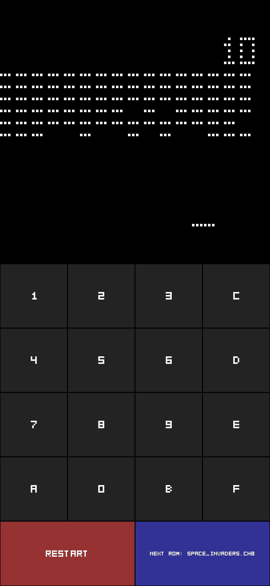
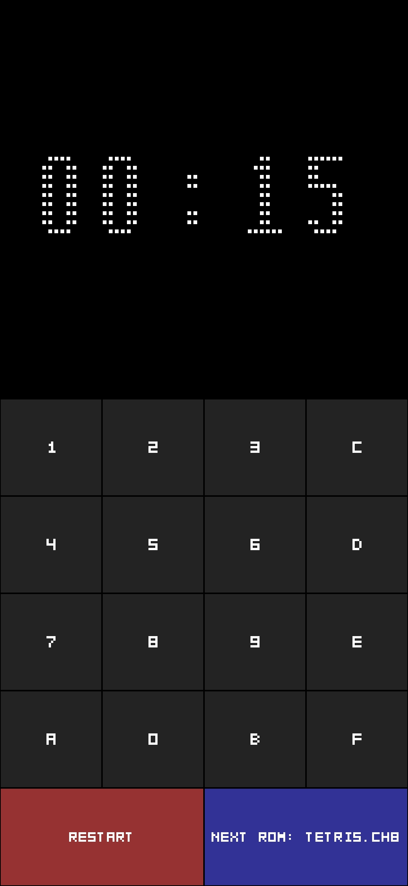
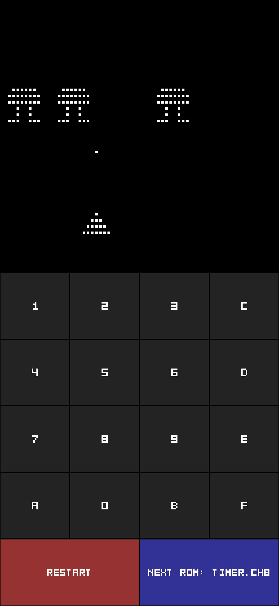

# CHIP-8 Emulator 👾


This project was built to understand the fundamentals of emulation with the following objectives:
- Implement All opcodes ✅
- Pass most known test ✅ (some are quirks dependent)
- Explore different quirks from chip8 ✅
- Provide configuration to tweak every detail 🚧 - (currently requires code changes)
- Run on Android using the same core logic ✅

## 💾 Roms
Roms are not included due to copyright restrictions.\
Instructions on how to add ROMs for each device will be provided.

## 📋 Prerequisites

To build and run this emulator, you will need:

* Linux: `sudo apt update && sudo apt install build-essential libsdl2-dev`

* Android: Android Studio with _NDK_ and _CMake_

## 🛠️ Build

**Linux:**
1. Clone the repository.

2. Compile the project:
    ```Bash
    make
    ```
3. Run the emulator passing a ROM path:
    ```Bash
    ./chip8 roms/my_rom.ch8
    ```

**Android:**
Since Android does not support terminal arguments, ROMs must be bundled as Assets:
1. Clone the repository.
2. Open the project in Android Studio.
3. Copy your roms (.ch8 files) to: chip88-android/app/src/main/assets/

4. Register the ROMs: 
    1. Open src/android_roms.c
    2. Update the rom_list array with your filenames and rom_count:
    ```C
    const char *rom_list[] = { "game1.ch8", "game2.ch8" };
    const int rom_count = 2;
    ```
    (Names must match the asset filenames)
5. Build or run the app from Android Studio

## 🖮 Controls (Desktop)
The original 4x4 keypad is mapped to your keyboard:
```
Original Keypad:      PC Keyboard:
+---+---+---+---+    +---+---+---+---+
| 1 | 2 | 3 | C |    | 1 | 2 | 3 | 4 |
+---+---+---+---+    +---+---+---+---+
| 4 | 5 | 6 | D | -> | Q | W | E | R |
+---+---+---+---+    +---+---+---+---+
| 7 | 8 | 9 | E |    | A | S | D | F |
+---+---+---+---+    +---+---+---+---+
| A | 0 | B | F |    | Z | X | C | V |
+---+---+---+---+    +---+---+---+---+
```

## 📸 Screenshots
### Desktop (Linux)
<p align="center">
  
  
</p>

### Mobile (Android)
<p align="center">
  
  
  
</p>